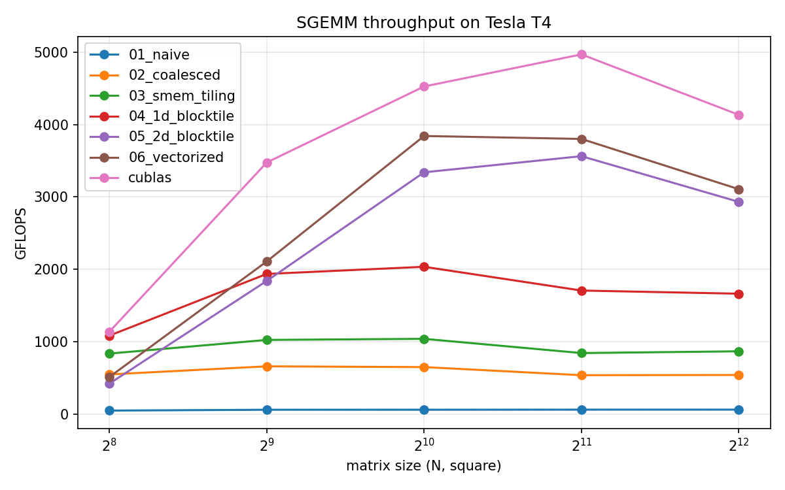

# cuda-sgemm

Optimizing a CUDA matrix multiply from a naive kernel to near-cuBLAS
performance, one optimization at a time, with every step measured.

All kernels compute `C = alpha * A @ B + beta * C` for row-major fp32
matrices. Correctness is verified against cuBLAS on every run.

## Results

<!-- Fill this in as you go. Numbers are at 4096x4096. -->

| # | Kernel | GFLOPS (T4) | % cuBLAS (T4) | GFLOPS (A100) | % cuBLAS (A100) |
|---|--------|------------:|--------------:|--------------:|----------------:|
| 0 | cuBLAS | | 100% | | 100% |
| 1 | naive | | | | |
| 2 | global memory coalescing | | | | |
| 3 | shared memory tiling | | | | |
| 4 | 1D block tiling | | | | |
| 5 | 2D block tiling | | | | |
| 6 | vectorized loads | | | | |




## What each step did and why it helped

<!-- Two to four sentences each, in your own words. Numbers, not adjectives. -->

**1 → 2, coalescing:**

**2 → 3, shared memory:**

**3 → 4, 1D block tiling:**

**4 → 5, 2D block tiling:**

**5 → 6, vectorized loads:**

## Where the remaining gap to cuBLAS comes from

<!-- After kernel 6, explain what cuBLAS does that you don't. -->

## Build and run

```
make ARCH=sm_75        # T4. sm_80 for A100.
./sgemm <kernel_id> [sizes...]   # 0 = cuBLAS, 1..6 = kernels
make bench             # everything, logged to results/results.csv
python scripts/plot.py
```

See [COLAB.md](COLAB.md) for running on a free Colab T4 and
[GUIDE.md](GUIDE.md) for the working order and what to read.

## References

- Simon Boehm, *How to Optimize a CUDA Matmul Kernel for cuBLAS-like Performance*
- Hwu, Kirk, El Hajj, *Programming Massively Parallel Processors*, 4th ed.
- NVIDIA CUDA C++ Programming Guide
