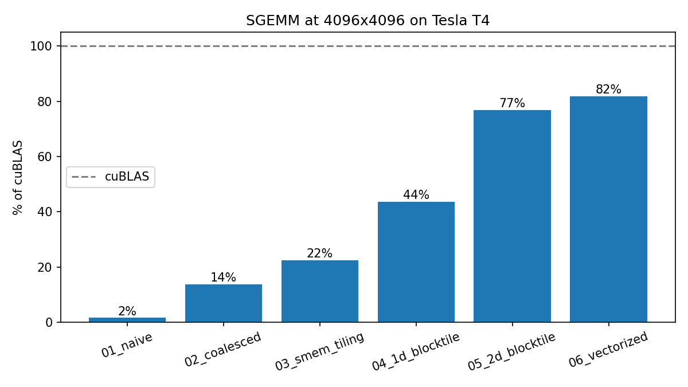

# cuda-sgemm

Optimizing a CUDA fp32 matrix multiply from a naive kernel to 80 to 92% of
cuBLAS, one optimization at a time, with every step measured and verified.

All kernels compute `C = alpha * A @ B + beta * C` for row-major fp32
matrices. Every run is checked element-by-element against cuBLAS.

The kernel sequence follows Simon Boehm's
[How to Optimize a CUDA Matmul Kernel for cuBLAS-like Performance](https://siboehm.com/articles/22/CUDA-MMM).
The benchmark harness, measurements, and analysis are mine.

## Results (NVIDIA Tesla T4, 4096 x 4096)

All numbers from a single `make bench` session so every kernel ran under the
same conditions.

| # | Kernel | GFLOPS | % of cuBLAS | Speedup vs naive |
|---|--------|-------:|------------:|-----------------:|
| 0 | cuBLAS | 4,134 | 100% | 67x |
| 1 | Naive | 62 | 1.6% | 1x |
| 2 | Global memory coalescing | 540 | 13.8% | 8.8x |
| 3 | Shared memory tiling | 868 | 22.5% | 14x |
| 4 | 1D block tiling (8 outputs/thread) | 1,663 | 43.6% | 27x |
| 5 | 2D block tiling (8x8 outputs/thread) | 2,932 | 76.8% | 48x |
| 6 | Vectorized loads, transposed A | 3,107 | 81.7% | 50x |

Kernel 6 reaches **92.2% of cuBLAS at 2048 x 2048** (3,801 GFLOPS).




**A note on measurement.** The T4 is a 70 W card and throttles under sustained
load: cuBLAS itself ranged from 4,134 to 4,969 GFLOPS across sizes in the same
session, and every line dips at 4096. For that reason I compare kernels by
% of cuBLAS (both measured back to back on the same problem) rather than raw
GFLOPS.

## What each step did and why it helped

**1 → 2, coalescing (8.8x).** In the naive kernel, adjacent threads in a warp
computed adjacent *rows* of C, so their reads of A were K floats apart and each
needed its own memory transaction. Remapping thread IDs so adjacent threads
compute adjacent *columns* means the 32 threads of a warp read one shared value
of A and 32 consecutive values of B, which the hardware serves in a single
transaction. Same math, same number of loads, far fewer transactions.

**2 → 3, shared memory tiling (1.6x).** Kernel 2 still fetched every A and B
element from DRAM once per thread that used it. Each block now loads a 32x32
tile of A and B into shared memory (on-chip SRAM) once, and all 1024 threads
reuse it. Two barriers are required: one so no thread reads a half-loaded tile,
one so no thread overwrites the tile while others are still reading it. The
gain is smaller than step 2 because the bottleneck moved: each thread now does
two shared-memory loads per multiply-add, so shared memory bandwidth is the
new limit.

**3 → 4, 1D block tiling (1.9x).** Each thread computes 8 outputs in a column
instead of 1. It loads a value of B from shared memory once, holds it in a
register, and uses it for 8 multiply-adds. The load:FMA ratio drops from 2:1 to
about 9:8. Tiles change shape to 64x64 outputs with BK=8 so shared memory usage
stays small.

**4 → 5, 2D block tiling (1.8x).** Each thread computes an 8x8 patch. Per step
it loads 8 values of A and 8 of B into registers, then does 64 multiply-adds
from registers: 16 loads per 64 FMAs. The kernel uses 123 registers per thread
with zero spills, which limits it to 2 blocks per SM (50% occupancy). That's a
deliberate trade: less parallelism, far more work per thread. The ratio
improved 4x but throughput only 1.8x, because the next bottlenecks surface:
strided scalar loads from shared memory and bank conflicts on the A tile.

**5 → 6, vectorized loads (1.06x at 4096, ~7% more of cuBLAS at 2048).** A is
stored transposed in shared memory so each thread's 8 A values for a given k
are contiguous, which lets them compile to 128-bit vector loads instead of
strided scalar loads. Global loads and the final C write use `float4` too.

## Where the remaining gap to cuBLAS comes from

Not yet profiled (next step, see below). Expected contributors: no warp-level
tiling, no double buffering to overlap loads with compute, residual bank
conflicts on the transposed A store, tile sizes not tuned for the T4, and 50%
occupancy from register pressure.

## Next steps

- [ ] Profile every kernel with Nsight Compute (DRAM/SM throughput, occupancy,
      bank conflicts) and replace the "expected" reasoning above with measurements
- [ ] Kernel 7: warp tiling
- [ ] Kernel 8: tensor cores (`wmma`)
- [ ] Rerun on an A100 for clean, unthrottled numbers

## Build and run

```
make ARCH=sm_75        # T4. sm_80 for A100.
./sgemm <kernel_id> [sizes...]   # 0 = cuBLAS, 1..6 = kernels
make bench             # everything, logged to results/results.csv
make ptxas             # registers and spills per kernel
python scripts/plot.py
```

See [COLAB.md](COLAB.md) for running on a free Colab T4.

## References

- Simon Boehm, *How to Optimize a CUDA Matmul Kernel for cuBLAS-like Performance*
- Hwu, Kirk, El Hajj, *Programming Massively Parallel Processors*, 4th ed.
- NVIDIA CUDA C++ Programming Guide
